# 📊 Awesome Log Analytics & Management 🚀

  
  
  
  

> **A curated ecosystem of SaaS platforms & open-source tools for log collection, indexing, search, security analytics (SIEM), alerting, and observability pipelines.**

---

## 💡 About & Core Features

Log analytics and management platforms enable SREs, DevOps engineers, and security teams to parse, centralize, index, search, and analyze log telemetry at scale. Whether troubleshooting distributed applications, enforcing compliance, or monitoring security incidents, choosing the right logging stack is critical for modern cloud-native architectures.

---

## 📑 Table of Contents

- [📈 Market Insights & Overview](#-market-insights--overview)
- [☁️ SaaS / Hosted Platforms](#%EF%B8%8F-saas--hosted-platforms)
- [⚡ Open-Source GitHub Projects](#-open-source-github-projects)
- [🤝 How to Contribute](#-how-to-contribute)
- [☕ Support & Sponsorship](#-support--sponsorship)
- [⭐ Star History](#-star-history)
- [⚠️ Disclaimer](#%EF%B8%8F-disclaimer)

---

## 📈 Market Insights & Overview

> **Market Size & Structure**: The global Log Analytics & Observability market is estimated at **$3.5 Billion – $4.2 Billion** (growing at a ~11.5% CAGR). The sector is **moderately fragmented**, featuring dominant enterprise leaders (Datadog, Splunk/Cisco, Microsoft Azure) alongside a rapidly growing ecosystem of developer-focused open-source alternatives (Grafana Loki, OpenSearch, SigNoz, OpenObserve).

---

## ☁️ SaaS / Hosted Platforms

Below is a curated comparison of enterprise SaaS log management and cloud analytics platforms, sorted by **Company Scale / Valuation (Descending)**:

| 🏢 Platform | 💰 Scale / Revenue / Valuation | 🏷️ Starting Pricing Tier | 🎁 Free Tier Limit / Trial Limit | 📌 Key Focus / Use Case |
| :--- | :--- | :--- | :--- | :--- |
| **[Azure Log Analytics](https://azure.microsoft.com/products/monitor/)** | Public (Microsoft $3.1T Market Cap) | ~$2.30 per GB ingested | 5 GB data ingestion / month free | Cloud-native KQL log analytics integrated with Azure Monitor & Sentinel. |
| **[Datadog Log Management](https://www.datadoghq.com/product/log-management/)** | Public ($99B Market Cap / ~$4.46B ARR) | $0.10 per GB ingested + $1.70 per 1M indexed events (3-day retention) | 14-Day Full-Featured Free Trial (No permanent free logging tier) | Unified full-stack observability with metrics, traces, and log correlation. |
| **[Splunk Cloud](https://www.splunk.com/en_us/products/splunk-cloud-platform.html)** | Acquired by Cisco ($28B valuation) | Enterprise volume tiers (est. ~$150+/GB/day at scale) | 14-Day Free Trial (up to 5 GB/day ingestion limit) | Industry standard enterprise machine-data platform with advanced SIEM analytics. |
| **[Elastic Cloud](https://www.elastic.co/cloud/)** | Public ($9.7B Market Cap) | ~$95/month standard deployment | 14-Day Free Trial (up to 8 GB RAM deployment limit) | Managed Elasticsearch & Kibana service for enterprise search and logging. |
| **[Sumo Logic](https://www.sumologic.com/)** | Acquired by Francisco Partners ($1.7B) | ~$3.00/GB Flex plan credits | Permanent Free Tier (20 credits/day, 7-day retention, 3 users) | Cloud-native continuous intelligence, threat detection, and log analytics. |
| **[Coralogix](https://coralogix.com/)** | Private ($1.6B Valuation / Series F) | $0.50 per GB (Ingestion & Stream analysis) | 14-Day Free Trial (Unlimited features & volume during trial) | Streaming log analytics without per-user fees, featuring Streama architecture. |
| **[Mezmo (formerly LogDNA)](https://www.mezmo.com/)** | Private (~$35M Series C raised) | $1.50 per GB ingested (30-day retention) | 14-Day Free Trial + Free Live Tail mode | Developer-centric log pipeline control, transformation, and ingestion routing. |
| **[Logz.io](https://logz.io/)** | Private (VC-backed / ~$60M raised) | $0.92 per GB ingested | 14-Day Free Trial (Full feature access) | Managed OpenSearch & ELK stack offering security and log analytics. |
| **[Graylog Cloud](https://graylog.org/products/graylog-cloud/)** | Private (Est. $15.8M ARR) | $1,500/month (includes 5 GB/day ingestion) | 14-Day Free Product Evaluation Trial | Enterprise managed Graylog instance with centralized search and alerting. |
| **[Papertrail](https://www.papertrail.com/)** | Private (SolarWinds subsidiary) | $7.00/month (1 GB/month data allowance) | Permanent Free Tier (50 MB/month allowance, 48-hour search retention) | Simple, instant-setup cloud log management for developers and small apps. |

---

## ⚡ Open-Source GitHub Projects

The open-source logging ecosystem features powerful self-hosted analytics engines, vector forwarders, and full-stack observability suites. Below are top repositories sorted by **GitHub Stars (Descending)**:

| 📦 Project Name | ⭐ GitHub Stars | 📝 Description & Primary Category |
| :--- | :--- | :--- |
| **[Elasticsearch](https://github.com/elastic/elasticsearch)** |  | Distributed, RESTful search and analytics engine powering the classic ELK stack. |
| **[SigNoz](https://github.com/SigNoz/signoz)** |  | Open-source OpenTelemetry-native full-stack observability platform (logs, metrics, traces). |
| **[Grafana Loki](https://github.com/grafana/loki)** |  | Like Prometheus, but for logs. High-efficiency label-indexed log aggregation system. |
| **[Vector](https://github.com/vectordotdev/vector)** |  | High-performance Rust-based data pipeline for collecting, transforming, and routing logs. |
| **[OpenObserve](https://github.com/openobserve/openobserve)** |  | Cloud-native observability engine designed as a low-cost alternative to Datadog/ELK using S3. |
| **[OpenSearch](https://github.com/opensearch-project/OpenSearch)** |  | Apache 2.0 open-source search and analytics suite forked from Elasticsearch. |
| **[Fluentd](https://github.com/fluent/fluentd)** |  | CNCF graduated unified logging layer and data collector with 500+ plugins. |
| **[Graylog](https://github.com/Graylog2/graylog2-server)** |  | Powerful open-source log management and SIEM platform with structured parsing. |
| **[Fluent Bit](https://github.com/fluent/fluent-bit)** |  | Fast and lightweight log processor and forwarder built for Linux, Embedded, & Kubernetes. |
| **[rsyslog](https://github.com/rsyslog/rsyslog)** |  | High-performance system for log processing, supporting syslog over IP networks. |

---

### 🛠️ Common Open-Source Architecture Patterns

- **Full-Text Search & Analytics**: Collect with `Fluent Bit` or `Vector` ➔ Index in `OpenSearch` / `Elasticsearch` ➔ Visualize with `Grafana` or `OpenSearch Dashboards`.
- **Cost-Efficient Label-Based Aggregation**: Ship logs via `Alloy` / `Promtail` ➔ Store in `Grafana Loki` ➔ Query with `Grafana`.
- **All-in-One Cloud Native Observability**: Stream logs via OpenTelemetry Collectors ➔ Store & analyze with `SigNoz` or `OpenObserve`.

---

## 🤝 How to Contribute

Contributions are warmly welcomed! Help build the most comprehensive log management guide:

1. Fork this repository.
2. Edit `README.md` to add or update relevant tools.
3. Ensure entries remain factual, clear, and include proper pricing/license details.
4. Submit a Pull Request!

Check out our curated meta-list at **[Awesome-Awesome-Awesome](https://github.com/ishandutta2007/Awesome-Awesome-Awesome)** for more awesome repositories!

---

## ☕ Support & Sponsorship

If you found this repository helpful, please consider starring, sharing, or sponsoring the project!

- ⭐ **Star this repository** to boost visibility for other SRE & DevOps engineers.
- 🔄 **Fork & Share** with your team or on social media.
- 💖 **Buy me a coffee**: Sponsor development on [GitHub Sponsors](https://github.com/sponsors/ishandutta2007).

---

## ⭐ Star History

---

## ⚠️ Disclaimer

This is a community-curated list intended for informational purposes only. Product names, pricing details, and logos belong to their respective owners. Self-hosted logging infrastructure requires adequate security configuration and compliance planning.
